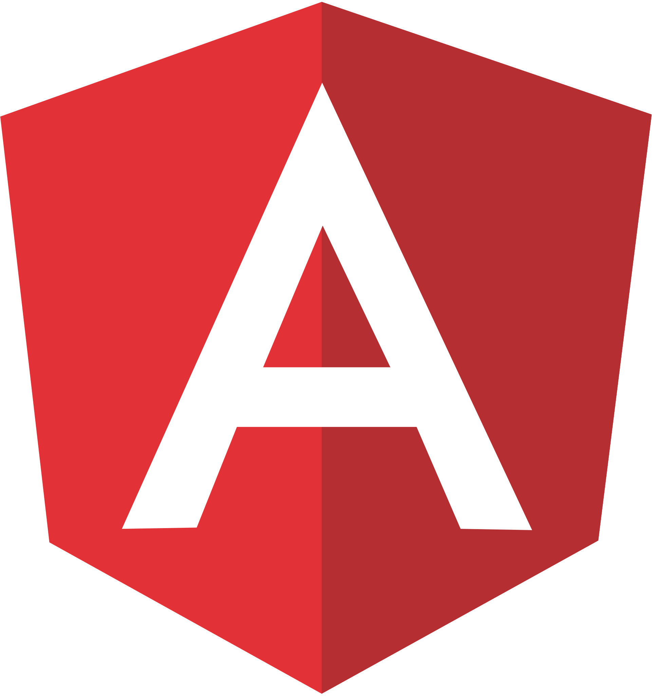

## Hi there 👋, I'm Harsh!

### 🧐 More About Me:

- 🔭 I’m currently working on [GCP Scanner](https://github.com/google/gcp_scanner) 
- 💬   Ask me about anything tech
- 📫   Feel free to ping me on [LinkedIn](https://www.linkedin.com/in/harsh-5a8a45216/)
- 📠  Checkout my [resume](https://docs.google.com/document/d/1cTnWHeDWKt423uFH5sqztFL9c8bpNrykXjekZswl7sY/edit?usp=sharing)
- ⚡ Fun fact: Not all fun facts are True.

### 🔨 Languages and Tools:

  
  
  
  
  
  
  
  
  
  
  

### 📊 Github Stats

